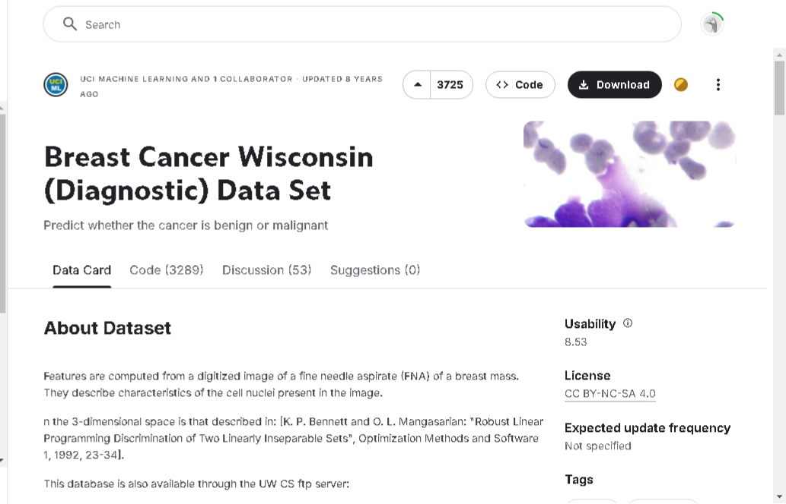

# Data Scientist

#### Technical Skills: Python, SQL, PowerBI, Excel, HTML, CSS

## Education             		
- B.Tech., Medical Physiology | Ladoke Akintola University of Technology (_May 2022_)
- SQI, Frontend (_May 2023_)
- Utiva, American Council of Training and Development Diploma in Data Analysis (_October 2024_)
- CoderHq, Data Science (-December  2024_)

## Work Experience
**Data Scientist and Analyst @ Computer College Plus (_August 2024 - Present_)**
- Teach students the basics of becoming a data analyst and scientist.
- Helping the Company with monthly analysis of the student satisfaction level on our teaching roadmaps. 

**Operational Manager @ Computer College Plus (_November 2024 - Present_)**
- Conducted data collection, processing, and analysis for the next Cohort.
- Provide services, research skills, and a smooth company run.

## Projects
### Creating a Hospital Database using MySQL
Let's explore the intricacies of an Entity-Relationship (ER) diagram for a hospital database. This diagram is a visual representation of the data model, showcasing how different entities within the hospital environment interact with one another. Understanding this will give profound insights into data flow and management in a healthcare setting.
My Final Thoughts:
Understanding the ER diagram of a hospital database isn't just about technical comprehension—it's about appreciating the intricate dance of data that supports patient care and hospital operations. This framework ensures that every piece of information is accessible, accurate, and interconnected, ultimately enhancing the health outcomes of patients.

### Breast Cancer Prediction using Machine Learning

Used **Python** to analyze the breast cancer data set I got from Kaggle (Breast Cancer Wisconsin Diagnostic Data set) I first understand my dataset after i did the data processing, Encoding the Target Variable, Splitting Data into Training and Testing Sets, Feature Scaling, Exploratory Data Analysis (EDA), Training Model, Prediction System and Save Model

Link: https://github.com/ifeoluwaoladeji/Breast-cancer-prediction-model.git

## Talks & Lectures
- Introduction to Data Analysis: The Computer College Plus  - Data Seminar, 2024
- Guest Lecture: Using Data in Religion Center - How to use data in the Religion center to get insights for growth and development.
